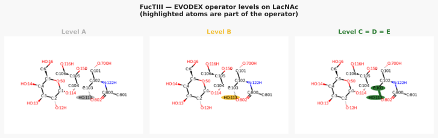
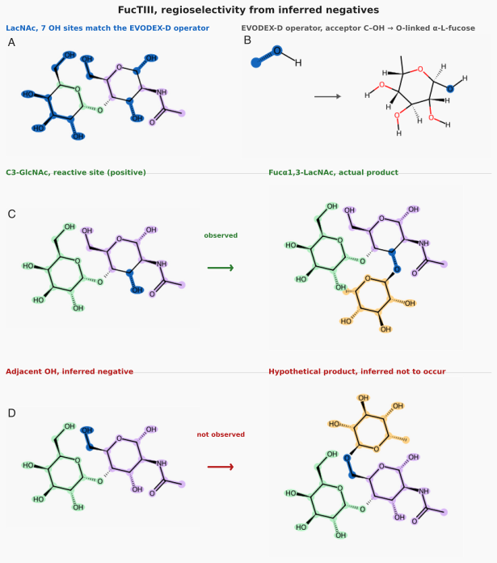
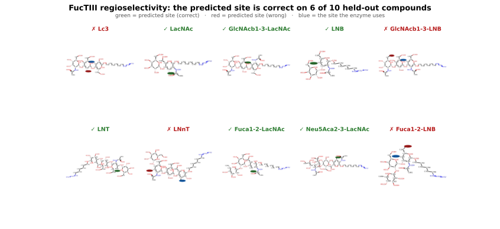

# FucTIII, regioselectivity from inferred negatives

## The enzyme

**FucTIII** is the *Helicobacter pylori* (DSM 6709) α1,3/4-fucosyltransferase. It transfers a fucose from GDP-fucose onto a hydroxyl of an oligosaccharide acceptor:

> GDP-Fuc + HO-C(substrate) → Fucα1,3/4-(substrate) + GDP

The products matter. FucTIII builds the **Lewis antigens**, Lewis x, Lewis a, and their sialylated and difucosylated relatives, and fucosylated **human-milk oligosaccharides** (LNFP V, LNFP VI, LNDFH II). These glycans decorate cell surfaces and mediate cell–cell recognition; *H. pylori* displays Lewis antigens on its lipopolysaccharide as molecular mimics of the host gastric epithelium, which helps it adhere and evade immune surveillance. Because they are hard to extract and hard to make chemically, a promiscuous bacterial fucosyltransferase like FucTIII is a valuable **biocatalyst** for producing them ([Tsai et al., *ACS Catalysis* 2019](https://doi.org/10.1021/acscatal.9b03752)).

For a biocatalyst, the practical question is **regiochemistry**: an oligosaccharide acceptor is studded with hydroxyls, and the enzyme strongly prefers one of them (other sites may react, but far more slowly, so the observable is a *preferred* site, not a single permissible one). This demonstration asks whether ESOREX can predict *which* hydroxyl, from a bare minimum of training.

## What the enzyme actually does

Tsai et al. characterized FucTIII across a panel of acceptors and found a simple rule: **the enzyme reads a Gal and fucosylates the sugar next to it, on whichever of C3/C4 the Gal leaves free.**

- **Type-2 chains** (Galβ1,**4**-linked): the Gal occupies C4, so fucose goes on **C3** → Lewis x.
- **Type-1 chains** (Galβ1,**3**-linked): the Gal occupies C3, so fucose goes on **C4** → Lewis a.

The acceptor sugar is usually **GlcNAc**, but not always: on lacto-series chains the reducing end is a Galβ1,4-**Glc** (lactose) unit, and FucTIII fucosylates that glucose's C3 exactly as if it were a type-2 GlcNAc. Two further quantitative preferences round out the picture, the enzyme favors **type-2 over type-1** (LacNAc's kcat/K_M is ~40× LNB's) and an extra **GlcNAc at the non-reducing end** improves binding (GlcNAcβ1,3-LacNAc is the best substrate in the panel).

## Three things ESOREX has to get right

1. **The product structure and stereochemistry.** That the fucose forms an α1,3 (or α1,4) linkage of an L-fucopyranose ring is fixed by the EVODEX mechanistic operator, inherited from the labeled reaction, ESOREX carries it through rather than rediscovering it.
2. **The sugar-scale preference.** From two reactions it should learn *what kind of sugar* the enzyme wants (the GlcNAc/type-2 preference), and score unrelated sugars low.
3. **The local site.** Within the right sugar it should pick the right hydroxyl, C3 vs C4, following the availability rule above.

Points 2 and 3 are two resolutions of one specificity: the larger scale of *which sugar* and the local scale of *which –OH on it*. ESOREX addresses both from the same two training reactions.

## The data

Data are from **Tsai et al., *ACS Catalysis* 2019** (DOI: 10.1021/acscatal.9b03752). Kinetic parameters (kcat, K_M) were measured for the shorter substrates; preparative synthesis yields were reported for the larger oligosaccharides. Every compound carries an azido-hexyl handle at the reducing-end anomeric position, a synthetic tag for immobilization and detection.

| # | Structure | Chain | Activity | Role |
|---|-----------|-------|----------|------|
| 11 | LacNAc | type-2 | 0.040 mM⁻¹s⁻¹ | training |
| 19 | LNB | type-1 | 0.00093 mM⁻¹s⁻¹ | training |
| 12 | GlcNAcβ1,3-LacNAc | type-2 | 1.40 mM⁻¹s⁻¹ | test |
| 2  | Lc3 (GlcNAcβ1,3-Galβ1,4-Glc) | type-2 | 0.060 mM⁻¹s⁻¹ | test |
| 20 | GlcNAcβ1,3-LNB | type-1 | 0.040 mM⁻¹s⁻¹ | test |
| 3  | LNT (Galβ1,3-GlcNAcβ1,3-Galβ1,4-Glc) | type-1 | 70% yield | test |
| 4  | LNnT (Galβ1,4-GlcNAcβ1,3-Galβ1,4-Glc) | type-2 | 70% yield | test |
| 15 | Fucα1,2-LacNAc | type-2 | 85% yield | test |
| 17 | Neu5Acα2,3-LacNAc | type-2 | 80% yield | test |
| 21 | Fucα1,2-LNB | type-1 | 51% yield | test |
| 22 | Neu5Acα2,3-LNB | type-1 | inactive | explicit negative |

Synthesis yields (compounds 3, 4, 15, 17, 21) are converted to a pseudo-kcat/K_M via a calibrated single-concentration kinetic model anchored to compound 11 (see `reports/fuctiii_compound_data.py`). The C3/C4 occupancy of each acceptor ring sets the reactive site: whichever of C3/C4 the neighboring Gal leaves as a free hydroxyl.

**The question:** trained only on **LacNAc** (reacts at C3) and **LNB** (reacts at C4), can ESOREX point to the right hydroxyl across the panel, the eight held-out compounds, plus the two training substrates as a check?

---

## Step 1, Every hydroxyl looks the same to the operator

The mechanistic operator for this reaction, derived from the LacNAc fucosylation, matches a carbon-bound hydroxyl (H–O–C):



| Level | What's encoded |
|-------|----------------|
| A | any bond to the accepting O, fires everywhere |
| B | O–C accepting bond, fires at every hydroxyl |
| C = D = E | O–C with the accepting carbon's full stereoelectronic context, the same hydroxyls |

The operator converges: at every level it matches *all* of the substrate's hydroxyls equally. It answers *"can the reaction happen here?"*, and for a sugar covered in –OH groups the answer is "yes, everywhere." It cannot answer *"does the enzyme prefer here?"* That is the specificity model's job.

---

## Step 2, Two reactions, and the negatives that come for free

Because every hydroxyl passes the operator, site preference can only come from the training data, and here there are only two reactions. The trick that makes this enough is the **inferred negative**:



**Panel A** shows the operator-matched hydroxyls on LacNAc, the starting ambiguity. **Panel B** is the operator itself. **Panels C and D** show the two kinds of signal one reaction delivers:

- **Panel C (the positive):** the C3-OH of GlcNAc is the site the enzyme used. One positive example.
- **Panel D (an inferred negative):** the C6-OH was available and the enzyme passed it over. Because the enzyme could have reached it and did not, it becomes a structural example the model learns to score *below* the site that reacted, at no extra experimental cost.

This is the panel's key idea: **a single regioselective reaction is not one data point but many.** The one hydroxyl that reacted is a positive; every other accessible hydroxyl is an inferred negative. On the assay substrates (seven operator-matched hydroxyls per disaccharide after the anomeric tag), the two training reactions yield:

| Training substrate | Reactive site (positive) | Hydroxyls passed over (inferred negatives) |
|--------------------|--------------------------|--------------------------------------------|
| LacNAc (type-2)    | C3-GlcNAc                | 6 |
| LNB (type-1)       | C4-GlcNAc                | 6 |

So two reactions become **fourteen training examples, two positives and twelve inferred negatives.** Crucially, the negatives include the C4-OH of LacNAc (free but unused, because C3 is available) and the C3-OH of LNB (blocked by Gal), so the availability rule is written directly into the training signal.

---

## Step 3, What the two reactions teach the model

Each candidate hydroxyl becomes one example for the energetic specificity model: the site the enzyme used is favorable (a low activation energy), and every hydroxyl it passed over is unfavorable. Each site is represented with its reacting oxygen as the reaction center and the surrounding sugar as a carbon skeleton with electronic deltas hung on it (see [representation](../representation.md)), so "which carbon of which ring, and what sits next to it" becomes the signal. The model solves for an energy per feature that reproduces all fourteen training sites exactly.

**How the numbers are set (and what the negatives really are).** In `fuctiii_regioselectivity.build_energetic`, the reactive site of each natural is given a favorable energy scaled by that substrate's measured activity, `−0.5 × (activity / best_activity)`; every passed-over site is given a fixed unfavorable energy, `+0.5`. This asymmetry deserves a flag: **no rate is measured for a passed-over hydroxyl.** An unreacted hydroxyl is an *inferred* negative, not a demonstrated kinetic zero, the enzyme was able to reach it under the assay and did not fucosylate it appreciably, which is evidence that it is worse than the site that reacted, but not a measurement of how much worse. The `+0.5` is a modeling convention meaning "clearly unfavorable relative to the reactive site," not a fitted quantity; a different negative value would produce a different exact fit, so this choice materially shapes the model. What the model actually learns is the *contrast*, reactive versus passed-over local environment, not an absolute rate at any negative site.

What separates a reactive hydroxyl from a passed-over one is its local environment. The two reactive sites sit on a GlcNAc ring at the position the neighboring Gal leaves free (C3 when the Gal is β1,4, C4 when it is β1,3), and the model learns to favor that arrangement and penalize the rest, including the free-but-unused C4 of LacNAc and the Gal-blocked C3 of LNB, so the availability rule is written directly into the training signal. Because the same local signal that marks the site also marks the sugar (a GlcNAc-type acceptor at a Gal-adjacent position), the model expresses both scales of the specificity, *which sugar* and *which hydroxyl*, from the same two reactions.

---

## Step 4, Finding the site on the test panel

We run the trained model against every operator-matched hydroxyl of each compound and take the lowest-energy (fastest) site. The figure draws each substrate with the **predicted site in green when it matches the hydroxyl the enzyme uses, and red when it does not** (the enzyme's actual site is then marked in blue):



ESOREX picks the correct hydroxyl on **6 of 10 test compounds**, from only two training reactions.

The fucose the enzyme adds is a complete product, an **α-L-fucopyranose** in an **α1,3** linkage on type-2 chains and **α1,4** on type-1; that ring identity, anomeric configuration, and linkage geometry are all fixed by the EVODEX operator inherited from the two labeled reactions (point 1). ESOREX supplies only the one thing the operator cannot: *which hydroxyl* the fucose lands on.

**Correctly predicted (6):**
- **LacNAc, LNB**, the two training substrates.
- **Fucα1,2-LacNAc, Neu5Acα2,3-LacNAc**, type-2 chains with a Fuc or Neu5Ac decoration at the non-reducing end; the decoration sits away from the reactive region and the model still points to GlcNAc-C3.
- **GlcNAcβ1,3-LacNAc**, a type-2 trisaccharide; the model selects the reducing GlcNAc-C3.
- **LNT**, a type-1 tetrasaccharide; the model holds to GlcNAc-C4, the internal type-1 GlcNAc-C4 site.

**The four misses:**
- **LNnT** (Galβ1,4-GlcNAcβ1,3-Galβ1,4-Glc) presents **two** type-2-like C3 sites, the internal GlcNAc-C3 and the reducing-end Glc-C3. The enzyme uses the **Glc-C3**; ESOREX prefers the **GlcNAc-C3**. Both are C3 on different rings, right position, wrong ring, a genuine ambiguity between two chemically valid sites.
- **Lc3** (GlcNAcβ1,3-Galβ1,4-Glc): the enzyme reacts on the C3 of the **reducing-end glucose**, but the model points elsewhere. The site rule it learned on GlcNAc rings did not transfer cleanly to the glucose here.
- **GlcNAcβ1,3-LNB** and **Fucα1,2-LNB**, type-1 chains where the enzyme uses GlcNAc-C4; the model picks a different hydroxyl on the same molecule.

Two of the four misses (LNnT, Lc3) turn on the reducing-end **glucose**, a ring the model never trained on and cannot yet read as confidently as the GlcNAc it learned from; the other two are type-1 GlcNAc-C4 sites it places a hydroxyl off from.

**The explicit negative is a revealing false positive.** Neu5Acα2,3-LNB is inactive, a Neu5Ac cap on the type-1 Gal masks the recognition unit, so the enzyme never engages (contrast Neu5Acα2,3-**LacNAc**, a type-2 chain, which stays active → sialyl-Lewis x). ESOREX has no way to know this: run on it, it confidently predicts a plausible C4 site, and the EVODEX pre-filter passes it too because the hydroxyl is physically present. This marks the boundary of a *site-preference* model: it answers "given that the enzyme acts, where?", not "does the enzyme act at all?" That second question needs recognition-level information (here, the sialyl cap) that neither the operator nor the site model captures.

---

## Summary

FucTIII places its fucose by reading a Gal and fucosylating the neighbor's free position, **C3 in type-2 chains, C4 in type-1**. From just **two measured reactions**, expanded by inferred negatives into fourteen training examples, ESOREX identifies the reactive hydroxyl on **6 of 10** held-out compounds, getting both scales of the specificity, the GlcNAc/type preference and the local C3-vs-C4 choice, more often right than not from a bare minimum of data.

Its failure modes are honest. Two of the four misses (LNnT, Lc3) turn on the reducing-end glucose, a ring the model never trained on; the LNnT case in particular is a real ambiguity between two valid C3 sites. And the inactive compound (Neu5Acα2,3-LNB) is a confident false positive, a plausible site on a substrate the enzyme rejects for a recognition-level reason (a sialyl mask) that lives outside the site-preference question ESOREX is built to answer.

---

**Regenerate the assets** (`sites_figure.svg`, `predictions.svg`):

```bash
cd /path/to/ESOREX && source venv/bin/activate
python experiments/demonstrations/generate_fuctiii.py
```

---

*[← All demonstrations](../demonstrations.md)   ·   ESOREX docs [Home](../index.md)*
