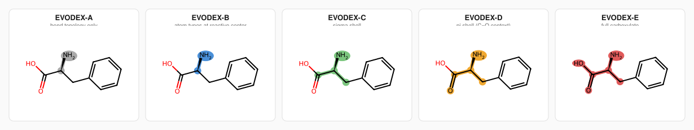
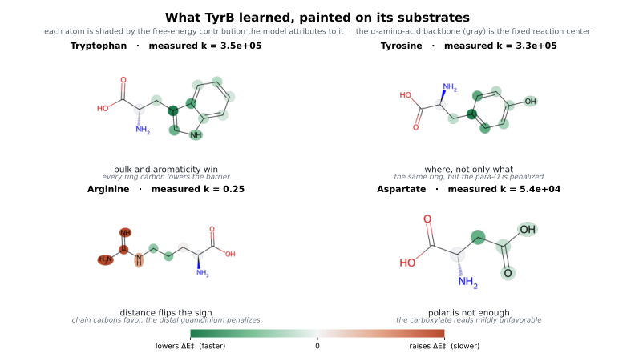
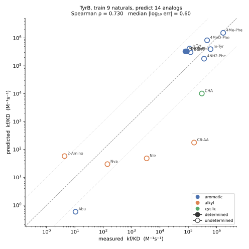
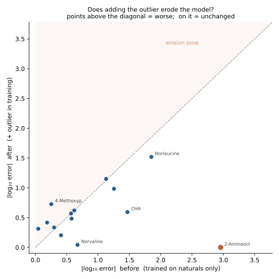

# TyrB, reading an aminotransferase as free energy

Given only TyrB's rates on the natural amino acids, can a free-energy model recover what its
active site cares about, and predict the unnatural substrates it has never seen? This vignette
walks through the enzyme, how the model represents its substrates, what it learns, its one honest
failure, and what happens when that failure is fed back into training.

Regenerate every figure below with:

```bash
cd /path/to/ESOREX && source venv/bin/activate
python experiments/demonstrations/generate_tyrb.py
```

## The enzyme

**TyrB** is the *Escherichia coli* K-12 tyrosine aminotransferase. It catalyzes the PLP-dependent
transamination of aromatic amino acids, primarily Phe, Tyr, and Trp, transferring the α-amino
group to a keto-acid acceptor:

> Ar-CH(NH₂)-COOH + α-KG → Ar-C(=O)-COOH + Glu

Every substrate undergoes the same transamination at the α-carbon; they differ only in the side
chain the active site must accommodate. That shared mechanistic core is the EVODEX reaction operator
, the fixed chemistry against which side-chain differences become the specificity signal.



*The operator at successively wider electronic scopes (A→E), drawn on phenylalanine. The E-level
operator locks down the α-amino-acid backbone (a chiral carbon bearing an amino group, a
carboxylate, and a side chain); the side chain is the passenger. All 23 substrates, and the 14
held-out analogs, pass the E-level mechanistic pre-filter, so specificity, not feasibility, is
what separates them.*

## The data

Kinetic data (kf/KD) are from **[Onuffer & Kirsch, *Protein Science* 1995](https://pubmed.ncbi.nlm.nih.gov/8528072/)**,
Table 2: 23 substrates measured under identical conditions across five orders of magnitude. The
training set is the **9 proteinogenic amino acids** with measured rates (Ala, Val, Leu, Asp, Glu,
Arg, Phe, Tyr, Trp); the test set is the **14 unnatural analogs**, substituted phenylalanines,
n-alkyl amino acids, cyclohexylalanine, and the non-proteinogenic diacid 2-aminoadipate. The test
set is not curated for agreement: a poor or surprising analog stays in it.

Each rate enters the model as an activation energy, `E = −RT ln k` (`esorex/constraint_system.py`),
not a normalized score.

## How the model represents a substrate

Each substrate is reduced to its **carbon skeleton**, and the erased chemistry returns as physical
deviations hung on the carbons: proton count, oxidation state, formal charge, lone pairs, and π
character (see [representation](../representation.md)). No functional groups are named; a hydroxyl or
a nitro is an emergent pattern of these primitives. The carbon skeletons of all nine training
substrates are **aligned into one shared frame** (the alignment that minimizes electron edit
distance, grown from the most active substrate outward), so a deviation is addressed by where it
sits on that common scaffold, and an identifiability collapse keeps only the distinctions the nine
measurements can support.

The model is a hard constraint, not a fit: it reproduces all nine training rates exactly, and keeps
the space of energetic decompositions the data leave underdetermined rather than resolving it
arbitrarily.

## What it learned about the active site

Because the energy is additive, `E_S = E₀ + Σ wᵢxᵢ`, every learned weight can be attributed back to
the exact atoms whose feature carries it. Painting a substrate, each atom takes the free-energy
contribution the model assigns to it, and summed over the atoms it reproduces that substrate's
prediction exactly. The picture below is that attribution on four training molecules: a portrait of
what TyrB's active site rewards and penalizes, recovered from nine rates with no chemical hypothesis
supplied in advance, and read directly off real structures.



*Four training substrates, each atom shaded by the free-energy contribution the model attributes to
it (green lowers the activation energy and accelerates the reaction, red raises it and slows it); the
α-amino-acid backbone in gray is the fixed reaction center. The geometry is the real 2D structure;
the shading is computed from the constraint system's weights, not drawn by hand.*

The dominant reward is bulk and aromaticity: every carbon of an aromatic ring lowers the activation
energy, which is why Trp, Tyr, and Phe are the best substrates. The most telling distinction is
**positional**. On tyrosine the ring paints green while its para-oxygen is the lone red atom, the
same ring rewarded, that one position penalized. Distance matters too, arginine's near-core chain
carbons paint green while its distal guanidinium paints strongly red, the same nitrogen chemistry
rewarded near the reaction center and penalized far from it. And polarity by itself is not enough,
aspartate's carboxylate reads mildly unfavorable rather than rewarded. Where a group sits, not only
what it is, sets its energetic effect, and the model read that off the rates.

The per-atom split is honest but not unique. The weights are a min-norm solution of an
underdetermined system, so each atom's share is one representative of the space the model keeps; the
summed prediction is what the data actually pin down. Only the combinations the data determine are
claimed.

## Predicting the 14 unnatural analogs



The model ranks the analogs well: held-out **Spearman ρ = 0.73** (0.77 without the single worst
point), most landing within a few-fold, a **median |log₁₀ error| ≈ 0.60** (≈ 4× in rate). One
substrate, **2-aminooctanoate**, a long straight aliphatic chain, comes out badly wrong, predicted
nearly 1000× too slow; it is the largest single miss. The model **flags** its predictions by
provenance: the aromatic tyrosine-family analogs, whose para-hydroxyl has a training precedent in
tyrosine, are *determined* and accurate; the aliphatic extrapolations, including 2-aminooctanoate,
are marked as such.

## Why it gets 2-aminooctanoate wrong

2-aminooctanoate has a long straight aliphatic side chain, large, but with no aromatic ring. In the
training naturals size and aromaticity always travel together, every large natural (Phe, Tyr, Trp) is
aromatic, so the model never sees the bulk reward on its own, only in the company of a ring. It cannot
separate "large" from "aromatic."

Faced with a side chain that is large but not aromatic, the additive model withholds the bulk reward
it never learned to grant alone, and predicts far too slow. It flags the prediction unresolved,
because the combination is unprecedented, but the estimate still lands orders of magnitude off. This
is the honest limit of an additive model trained where size, π, and aromaticity co-vary: the training
set holds no large non-aromatic acceptor to teach the two apart.

## Feeding the outlier back in

So the second experiment: put 2-aminooctanoate and its true rate into the training set and retrain.
Does one inconsistent, surprising measurement erode what the model already knew, or make it more
complete?



It integrates gracefully. 2-aminooctanoate is now reproduced **exactly** (the constraint system simply
absorbs it, no cooperative term required), and the other predictions barely move. The surprising point
does not overwrite what the naturals established; each existing substrate is still anchored by its own
measurement. New data, even data that contradicts the model's prior extrapolation, makes it more
nuanced without eroding it. That is the behavior a hard, constraint-based model is built to have: it
never trades away a known fact to fit a new one, it widens the represented world to hold both.

## What this shows

From nine amino acids, ESOREX recovers the correct dominant determinant, a large aromatic side chain:
reproduces the training exactly, predicts most novel analogs within a few-fold (held-out ρ = 0.73),
and is explicit about the ones it cannot: it flags the aliphatic extrapolations rather than trusting
them. Its blind spot is precisely where the training carries entangled signal (large-but-not-aromatic),
and adding the missing measurement resolves that case without cost to the rest. The full narrative,
with the diagnostics and per-substrate provenance, is in the generated report at
`experiments/transaminases/tyrb_energetic_report.html`.

---

*[← All demonstrations](../demonstrations.md)   ·   ESOREX docs [Home](../index.md)*
